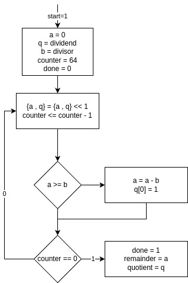
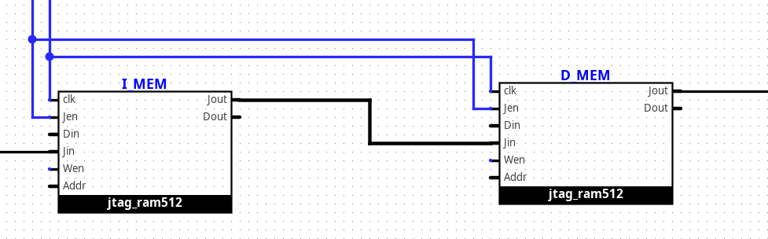

<div dir='rtl'>

- [تمرین ۱](#تمرین-۱)
- [تمرین ۲](#تمرین-۲)
- [تمرین ۳](#تمرین-۳)
- [تمرین ۴](#تمرین-۴)
- [تمرین ۵](#تمرین-۵)

# سیستم داوری تمرینات عملی درس معماری کامپیوتر

## برنامه های پیشنیاز

برای اجرای این سامانه، به برنامه های زیر نیازمندید :

</div>

```bash
    # iverilog
    # python (python-is-python3)
    # ubuntu/debian (apt) :
    sudo apt install iverilog python3 python-is-python3
    # arch (pacman)
    sudo pacman -S iverilog python
```

<div dir='rtl'>

### نحوه کارکرد سامانه داوری

سامانه داوری به طور کلی از ۲ جزء تشکیل شده است :

1. اسکریپت های کمک کننده :
   - <code dir='ltr'>./synthesize.sh</code> :
     این اسکریپت توصیف مدار شما را به کد وریلاگ سنتز میکند.
     این توصیف سنتز شده در پوشه
     <code dir='ltr'>~/logisim_evolution_workspace/</code> قرار میگیرد.
   - <code dir='ltr'>./validate.sh</code> :
     این اسکریپت با گرفتن تست بنچ داده شده (مربوط به همان سوال)
     و محل قرار گیری توصیف سنتز شده، مدار طراحی شده را آزمایش میکند و به آن نمره میدهد.
   - <code dir='ltr'>./synth_valid.sh</code> :
     این اسکریپت عملا ترکیب دو اسکریپت قبلی است و ابتدا فرایند سنتز را انجام میدهد و سپس
     خروجی سنتز را ارزیابی میکند.
2. فایل های تست بنچ :
   این فایل ها شامل منطق ساخت تست های مختلف و بررسی صحت مدار شما میباشند.
   با توجه به این که این فایل ها منطق نمره دهی را شامل میشوند، شما میتوانید مشکل مدارات خود را رفع کنید.

## تمرین ۱

در این تمرین شما یک
جمع/تفریق کننده ۴ بیتی طراحی
می‌کنید.

درگاه های این مدار عبارتند از :

</div>

```verilog
    input [3:0]a
    input [3:0]b
    input sub_notadd
    output [3:0]s
    output cout
```

<div dir='rtl'>
با توجه به آموخته هایتان در دروس گذشته، چنین مداری را
    میتوان به شکل زیر توصیف نمود :
</div>

```verilog
    sub_notadd  :    {cout , s} = a + b
    !sub_notadd :    {cout , s} = a + ~b + 1
```

<div dir='rtl'>

ارزیابی این تمرین با دستور زیر انجام میشود :

</div>

```bash
    ./synth_valid.sh ./HW1/bench.circ ./HW1/tb0.v
```

<div dir='rtl'>
با توجه به این که این تمرین اول است،
    صرفا جنبه دست گرمی و استفاده از سیستم داوری دارد،
    پاسخ آن عملا در فایل
    <code dir='ltr'>HW1/bench.circ</code>
    موجود است و صرفا شما باید در گزارشتان آنرا اجرا و بررسی کنید.
    البته با توجه به این که در ادامه درس با مدارات بسیار پیچیده تر
    مواجه خواهید شد، توصیه اکید من این است که شما یک دور دست خود
    را برای استفاده از
    <code dir='ltr'>logisim</code>
    گرم کنید و این مدار را به روش خود طراحی کنید.

## تمرین ۲

### سوال ۱

مداری طراحی کنید که طبق دستورات زیر کار کند :

</div>

```verilog
load:   rl <= in1
0:      r2 <= -r1
1:      r2 <= r1 & r2
2:      r2 <= -r2
3:      out1 <= r1 + r2
        r2   <= r1 + r2
```

<div dir='rtl'>

درگاه های این مدار عبارتند از :

</div>

```verilog
    input [31:0]in1
    input load
    input clk
    output [31:0]out1
```

<div dir='rtl'>

ارزیابی این تمرین با دستور زیر انجام میشود :

</div>

```bash
    ./synth_valid.sh schematic.circ ./HW2/tb1.v
```

<div dir='rtl'>

### سوال ۲

مطابق فلو چارت زیر، مدار مورد نظر را طراحی کنید:

<center>


توجه کنید که منظور از {a,q} این است که
بیت های a را سمت چپ(جایگاه پر ارزش تر) بیت های
q قرار میدهیم.

</center>
درگاه های این مدار عبارتند از :

</div>

```verilog
    input [31:0]divisor
    input [31:0]dividend
    input start
    input clk
    output [31:0]quotient
    output [31:0]remainder
    output done
```

<div dir='rtl'>

ارزیابی این تمرین با دستور زیر انجام میشود :

</div>

    ./synth_valid.sh schematic.circ ./HW2/tb2.v

<div dir='rtl'>

## تمرین ۳

در این تمرین واحد حسابی منطقی (ALU) پردازنده را میسازیم!
این واحد به طور کلی به ۳ بخش آماده سازی،
محاسبه و تولید خروجی تقسیم میشود.
درضمن تقسیم بنده بیان شده برداشت شخصی است و میتوانید برداشت خود را نیز داشته باشید.

درگاه های این مدار عبارتند از :

</div>

```verilog
    input [31:0] a
    input [31:0] b
    input [ 3:0] aluop
    input output_inverted
    input output_inc
    input clk
    input rst
    output [31:0] res_low
    output [31:0] res_high
    output done
```

<div dir='rtl'>

این واحد مسئول محاسبه تمامی اعمال حسابی و منطقی مورد نیاز در سطح ثبات ها در سیستم
ماست. بنابرین باید دستورات زیر را با استفاده از aluop پشتیبانی کند :

0. ADD :
   با استفاده از الگوریتم Carry Select Adder با طول بلوک های ۴ تایی این عملیات را پیاده سازی کنید.
1. SUB :
   با تغییر جزئی در نحوه کارکرد با جمع کننده تفریق کننده را نیز پیاده کنید. ( میتوانید از بیت ۰ به عنوان
   sub_not_add استفاده کنید )
2. MUL :
   ضرب بدون علامت a و b را با استفاده از نسخه بهبود
   یافته(با استفاده از الگوریتم Carry Save Adder در هر مرحله
   ۲ رقم جلو میرویم) الگوریتم شیفت و جمع برای صحت در کارکرد به یک سیگنال start نیاز دارد
   که آنرا میتوانید با مقایسه کردن درخواست این کلاک با آخرین درخواست صادر شده بدست بیاورید.
3. DIV :
   با استفاده از الگوریتمی که در تمرین گذشته پیاده کردید این مورد را نیز انجام دهید.
   همچنین با توجه به نیاز الگوریتم تمرین قبل به start ، میتوانید آنرا با استفاده از تکنیک قبلی تولید کنید.
4. AND
5. OR
6. XOR
7. CLO :
   این عملیات تعداد بیت های ۱ مقدم عدد a را میشمارد. برای ایده گرفتن از نحوه پیاده سازی این عملیات میتوانید
   به
   [کد وریلاگ ضمیمه](HW3/alu.v)
   نگاه کنید.

8. CLZ :
   به طور مشابه عمل قبلی، تعداد بیت های ۰ مقدم عدد a را میشمارد.
9. SLL : شیفت چپ منطقی
10. SRL : شیفت راست منطقی
11. SRA : شیفت راست حسابی
12. ROTR : چرخش به راست

حال پس از این اعمال، برای این که تعداد opcode های ALU منطقی باشند، علاوه بر عمل مشخص شده در opcode باید
به output_inverted و output_inc نگاه کنیم.
در این صورت خروجی به صورت زیر خواهد بود :

</div>

```verilog
    output_inverted  :  {res_high, res_low} =~{calc_high, calc_low} + output_inc
    !output_inverted :  {res_high, res_low} = {calc_high, calc_low} + output_inc
```

<div dir='rtl'>

در نهایت، ارزیابی این تمرین با دستور زیر انجام میشود :

</div>

```bash
    ./synth_valid.sh schematic.circ ./HW3/tb.v
```

<div dir='rtl'>

## تمرین ۴

در این تمرین قصد داریم یک پردازنده ساده با پشتیبانی از زیرمجموعه بسیار محدودی از دستورات
mips little endian
را پیاده کنیم.

</div>

### **MIPS R-Type Instruction Format**

| Bit Range | Field Name | Width (bits) | Description                            |
| --------- | ---------- | ------------ | -------------------------------------- |
| 31 – 26   | `opcode`   | 6            | Operation code (`0` for R-type).       |
| 25 – 21   | `rs`       | 5            | First source register operand.         |
| 20 – 16   | `rt`       | 5            | Second source register operand.        |
| 15 – 11   | `rd`       | 5            | Destination register operand.          |
| 10 – 6    | `shamt`    | 5            | Shift amount (for shift instructions). |
| 5 – 0     | `funct`    | 6            | Function code (extends `opcode`).      |

```
31   26|25  21|20  16|15  11|10  6|5     0
+------+------+------+------+-----+-------+
|opcode|  rs  |  rt  |  rd  |shamt| funct |
+------+------+------+------+-----+-------+
```

### **MIPS I-Type Instruction Format**

| Bit Range | Field Name  | Width (bits) | Description                                   |
| --------- | ----------- | ------------ | --------------------------------------------- |
| 31 – 26   | `opcode`    | 6            | Operation code (determines instruction type). |
| 25 – 21   | `rs`        | 5            | Source register operand.                      |
| 20 – 16   | `rt`        | 5            | Destination/target register operand.          |
| 15 – 0    | `immediate` | 16           | Immediate value or offset.                    |

```
 31  26|25  21|20  16|15               0
+------+------+------+------------------+
|opcode|  rs  |  rt  |     immediate    |
+------+------+------+------------------+
```

### **MIPS Instruction Encoding Reference**

| Instruction | Type   | Opcode   | Funct    | Notes                                                    |
| ----------- | ------ | -------- | -------- | -------------------------------------------------------- |
| `add`       | R-Type | `000000` | `100000` | `rd = rs + rt`                                           |
| `addi`      | I-Type | `001000` | —        | `rt = rs + imm` (sign-extended)                          |
| `sub`       | R-Type | `000000` | `100010` | `rd = rs - rt`                                           |
| `or`        | R-Type | `000000` | `100101` | `rd = rs \| rt` (bitwise OR)                             |
| `and`       | R-Type | `000000` | `100100` | `rd = rs & rt` (bitwise AND)                             |
| `xor`       | R-Type | `000000` | `100110` | `rd = rs ^ rt` (bitwise XOR)                             |
| `sll`       | R-Type | `000000` | `000100` | `rd = rs << rt` (logical shift left)                     |
| `srl`       | R-Type | `000000` | `000110` | `rd = rs >> rt` (logical shift right)                    |
| `sra`       | R-Type | `000000` | `000111` | `rd = rs >>> rt` (arithmetic shift right, sign-extended) |

<div dir='rtl'>

### واحد حافظه پردازنده

برای این که بتوانیم به سهولت پردازنده خود را مورد آزمون قرار دهیم، از مکانیزم تحت عنوان JTAG استفاده میکنیم
که بتوانیم به آسانی محتوای حافظه های دستور و داده برنامه را تنظیم و بازخوانی کنیم.

اتصالات واحد حافظه با JTAG به صورت زیر میشود :



درگاه های این مدار عبارتند از :

</div>

```verilog
    input clk
    input rst
    input [31:0] Jin
    input Jen
    output [31:0] Jout
    output [31:0] R1...R31
```

<div dir='rtl'>

در نهایت، ارزیابی این تمرین با دستور زیر انجام میشود :

</div>

```bash
    ./synth_valid.sh schematic.circ ./HW4/tb.v
```

<div dir='rtl'>

## تمرین ۵

دستورات زیر را به پردازنده اضافه کنید :

</div>

| Instruction | Type   | Opcode   | Funct    | Notes                                   |
| ----------- | ------ | -------- | -------- | --------------------------------------- |
| `div`       | R-Type | `000000` | `011010` | `hi = rs % rt; lo = rs / rt`            |
| `sll`       | R-Type | `000000` | `000000` | `rd = rt << shamt` (logical shift left) |
| `mfhi`      | R-Type | `000000` | `010000` | `rd = hi`                               |
| `mflo`      | R-Type | `000000` | `010010` | `rd = lo`                               |
| `sw`        | I-Type | `101011` | —        | `*(int*)(offset+rs)=rt` (sign-extended) |
| `lw`        | I-Type | `100011` | —        | `rt=*(int*)(offset+rs)` (sign-extended) |
| `bne`       | I-Type | `000101` | —        | `if(rs!=rt) pc+=offset` (sign-extended) |
| `slti`      | I-Type | `001010` | —        | `rt=rs<imm` (sign-extended)             |
| `jmp`       | I-Type | `000010` | —        | `pc=target`                             |

<div dir='rtl'>

با توجه به این که دستور div به چند چرخه ساعت زمان نیاز دارد،
باید سیگنال `InstDone` را به پردازنده خود اضافه کنید که مشخص کند که دقیقا چه زمانی دستور
محاسبه خود را انجام داده و از این طریق با سامانه داوری هماهنگ شود.
همینطور توجه کنید که با توجه به این وضعیت ممکن است به خاطر
مشکل در طراحیتان `InstDone` هیچ گاه ۱ نشود و در نتیجه در چرخه بینهایت باقی میماند،
در این شرایط
`Ctrl+C`
را بزنید و سپس در ترمینال iverilog،
دستور `finish`
را بزنید تا شبیهسازی متوقف شود و به اصلاح پردازنده خود بازگردید.

ارزیابی این تمرین با دستور زیر انجام میشود :

</div>

```bash
    ./synth_valid.sh schematic.circ ./HW5/tb.v
```
