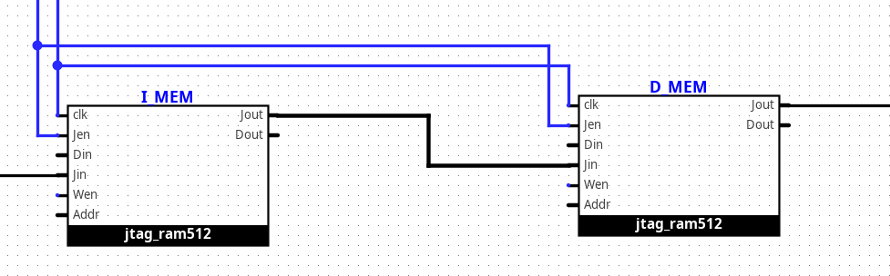

- [Persian version](Readme-fa.md)
- [Homework 1](#homework-1)
- [Homework 2](#homework-2)
- [Homework 3](#homework-3)
- [Homework 4](#homework-4)
- [Homework 5](#homework-5)

# Computer Architecture Course, Practical Homework Grading System

## Prerequisites

To run this system, you will need the following programs:

```bash
# iverilog
# python (python-is-python3)
# ubuntu/debian (apt):
sudo apt install iverilog python3 python-is-python3
# arch (pacman)
sudo pacman -S iverilog python
```

### How the Grading System Works

The grading system consists of two main components:

1. **Helper Scripts**:

   - `./synthesize.sh`:
     This script synthesizes your circuit description into Verilog code.
     The synthesized description is placed in the `~/logisim_evolution_workspace/` directory.
   - `./validate.sh`:
     This script takes the given test bench (related to the specific question)
     and the location of the synthesized description, tests the designed circuit, and assigns a score.
   - `./synth_valid.sh`:
     This script essentially combines the two previous scripts. It first performs the synthesis process and then evaluates the synthesized output.

2. **Test Bench Files**:
   These files contain the logic for creating various tests and verifying the correctness
   of your circuit. Since these files include the scoring logic, you can use them to debug and fix issues in your circuits.

## Homework 1

In this homework, you will design a 4-bit adder/subtractor.

The ports of this circuit are as follows:

```verilog
input [3:0] a
input [3:0] b
input sub_notadd
output [3:0] s
output cout
```

Based on what you have learned in previous courses, such a circuit can be described as follows:

```verilog
sub_notadd  :    {cout , s} = a + b
!sub_notadd :    {cout , s} = a + ~b + 1
```

The evaluation of this exercise is done with the following command:

```bash
./synth_valid.sh ./HW1/bench.circ ./HW1/tb0.v
```

Since this is the first exercise, it is primarily intended for practice
and familiarization with the grading system. The answer is essentially provided
in the file `./HW1/bench.circ`, and you only need to execute and review it in your report.
However, given that you will encounter much more complex circuits later in the course,
I strongly recommend that you take this opportunity to get comfortable with using `logisim` and design this circuit on your own.

## Homework 2

### Question 1

Design a circuit that operates according to the following instructions:

```
load:   rl <= in1
0:      r2 <= -r1
1:      r2 <= r1 & r2
2:      r2 <= -r2
3:      out1 <= r1 + r2
        r2   <= r1 + r2
```

The ports of this circuit are as follows:

```verilog
input [31:0] in1
input load
input clk
output [31:0] out1
```

The evaluation of this question is done with the following command:

```bash
./synth_valid.sh schematic.circ ./HW2/tb1.v
```

### Question 2

Design the circuit according to the flowchart below:

<center>


Note that {a,q} means placing the bits of `a` to the left (more significant bits) of the bits of `q`.

</center>

The ports of this circuit are as follows:

```verilog
input [31:0] divisor
input [31:0] dividend
input start
input clk
output [31:0] quotient
output [31:0] remainder
output done
```

The evaluation of this question is done with the following command:

```bash
./synth_valid.sh schematic.circ ./HW2/tb2.v
```

## Homework 3

In this exercise, we will build the Arithmetic Logic Unit (ALU) of the processor!
This unit is generally divided into three parts: preparation, computation, and output generation.
Note that this division is a personal interpretation, and you may have your own interpretation as well.

The ports of this circuit are as follows:

```verilog
input [31:0] a
input [31:0] b
input [ 3:0] aluop
input output_inverted
input output_inc
input clk
input rst
output [31:0] res_low
output [31:0] res_high
output done
```

This unit is responsible for computing all the arithmetic and logical operations required at the register level in our system. Therefore, it must support the following instructions using `aluop`:

0. **ADD**:
   Implement this operation using the Carry Select Adder algorithm with 4-bit block lengths.
1. **SUB**:
   Implement the subtractor with minor modifications to the adder (you can use bit 0 as `sub_not_add`).
2. **MUL**:
   Perform unsigned multiplication of `a` and `b` using an improved version of the shift-and-add algorithm (using Carry Save Adder at each step, advancing 2 digits at a time). For correct operation, this requires a `start` signal, which you can obtain by comparing the current request with the last issued request.
3. **DIV**:
   Implement this using the algorithm you developed in the previous homework. Since the algorithm from the previous homework also requires a `start` signal, you can generate it using the same technique as above.
4. **AND**
5. **OR**
6. **XOR**
7. **CLO**:
   This operation counts the number of leading 1s in `a`. For implementation ideas, refer to the [attached Verilog code](HW3/alu.v).
8. **CLZ**:
   Similarly, this operation counts the number of leading 0s in `a`.
9. **SLL** (Shift Left Logical)
10. **SRL** (Shift Right Logical)
11. **SRA** (Shift Right Arithmetic)
12. **ROTR** (Rotate Right)

After performing these operations, to keep the number of ALU opcodes logical, in addition to the operation specified by the opcode, we must also consider `output_inverted` and `output_inc`. In this case, the output will be as follows:

```verilog
output_inverted  :  {res_high, res_low} =~{calc_high, calc_low} + output_inc
!output_inverted :  {res_high, res_low} = {calc_high, calc_low} + output_inc
```

Finally, the evaluation of this homework is done with the following command:

```bash
./synth_valid.sh schematic.circ ./HW3/tb.v
```

## Homework 4

In this exercise, we aim to implement a simple processor supporting a very limited subset of MIPS (little-endian) instructions.

### **MIPS R-Type Instruction Format**

| Bit Range | Field Name | Width (bits) | Description                            |
| --------- | ---------- | ------------ | -------------------------------------- |
| 31 – 26   | `opcode`   | 6            | Operation code (`0` for R-type).       |
| 25 – 21   | `rs`       | 5            | First source register operand.         |
| 20 – 16   | `rt`       | 5            | Second source register operand.        |
| 15 – 11   | `rd`       | 5            | Destination register operand.          |
| 10 – 6    | `shamt`    | 5            | Shift amount (for shift instructions). |
| 5 – 0     | `funct`    | 6            | Function code (extends `opcode`).      |

```
31   26|25  21|20  16|15  11|10  6|5     0
+------+------+------+------+-----+-------+
|opcode|  rs  |  rt  |  rd  |shamt| funct |
+------+------+------+------+-----+-------+
```

### **MIPS I-Type Instruction Format**

| Bit Range | Field Name  | Width (bits) | Description                                   |
| --------- | ----------- | ------------ | --------------------------------------------- |
| 31 – 26   | `opcode`    | 6            | Operation code (determines instruction type). |
| 25 – 21   | `rs`        | 5            | Source register operand.                      |
| 20 – 16   | `rt`        | 5            | Destination/target register operand.          |
| 15 – 0    | `immediate` | 16           | Immediate value or offset.                    |

```
 31  26|25  21|20  16|15               0
+------+------+------+------------------+
|opcode|  rs  |  rt  |     immediate    |
+------+------+------+------------------+
```

### **MIPS Instruction Encoding Reference**

| Instruction | Type   | Opcode   | Funct    | Notes                                                    |
| ----------- | ------ | -------- | -------- | -------------------------------------------------------- |
| `add`       | R-Type | `000000` | `100000` | `rd = rs + rt`                                           |
| `addi`      | I-Type | `001000` | —        | `rt = rs + imm` (sign-extended)                          |
| `sub`       | R-Type | `000000` | `100010` | `rd = rs - rt`                                           |
| `or`        | R-Type | `000000` | `100101` | `rd = rs \| rt` (bitwise OR)                             |
| `and`       | R-Type | `000000` | `100100` | `rd = rs & rt` (bitwise AND)                             |
| `xor`       | R-Type | `000000` | `100110` | `rd = rs ^ rt` (bitwise XOR)                             |
| `sll`       | R-Type | `000000` | `000100` | `rd = rs << rt` (logical shift left)                     |
| `srl`       | R-Type | `000000` | `000110` | `rd = rs >> rt` (logical shift right)                    |
| `sra`       | R-Type | `000000` | `000111` | `rd = rs >>> rt` (arithmetic shift right, sign-extended) |

### Processor Memory Unit

To facilitate testing of our processor, we'll implement a JTAG mechanism for easy programming and reading of instruction and data memories.

Memory unit connections with JTAG:



The ports of this circuit are as follows:

```verilog
    input clk
    input rst
    input [31:0] Jin
    input Jen
    output [31:0] Jout
    output [31:0] R1...R31
```

The evaluation of this exercise is performed with:

```bash
    ./synth_valid.sh schematic.circ ./HW4/tb.v
```

## Homework 5

Add following instructions to your processor :

| Instruction | Type   | Opcode   | Funct    | Notes                                   |
| ----------- | ------ | -------- | -------- | --------------------------------------- |
| `div`       | R-Type | `000000` | `011010` | `hi = rs % rt; lo = rs / rt`            |
| `sll`       | R-Type | `000000` | `000000` | `rd = rt << shamt` (logical shift left) |
| `mfhi`      | R-Type | `000000` | `010000` | `rd = hi`                               |
| `mflo`      | R-Type | `000000` | `010010` | `rd = lo`                               |
| `sw`        | I-Type | `101011` | —        | `*(int*)(offset+rs)=rt` (sign-extended) |
| `lw`        | I-Type | `100011` | —        | `rt=*(int*)(offset+rs)` (sign-extended) |
| `bne`       | I-Type | `000101` | —        | `if(rs!=rt) pc+=offset` (sign-extended) |
| `slti`      | I-Type | `001010` | —        | `rt=rs<imm` (sign-extended)             |
| `jmp`       | I-Type | `000010` | —        | `pc=target`                             |

Since the div instruction requires multiple clock cycles to complete, you need to implement the `InstDone` signal in your processor design. This signal indicates when the instruction has finished execution and helps synchronize with the grading system.

The evaluation of this exercise is performed with:

```bash
    ./synth_valid.sh schematic.circ ./HW5/tb.v
```
